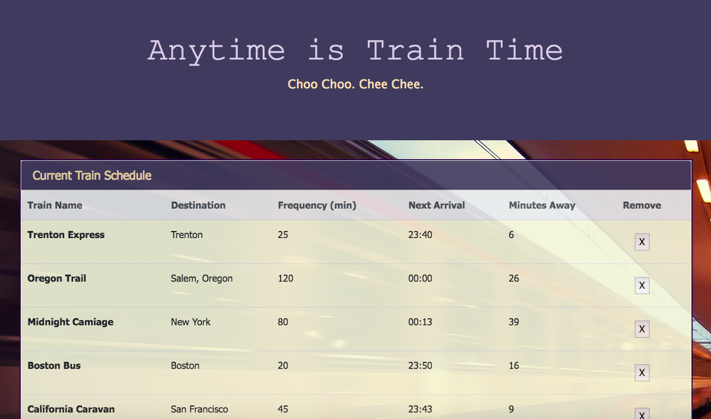

# Train-Scheduler
Assignment_Train-Scheduler

# Link to deployed site
https://lalatw.github.io/Train-Scheduler/


# Images


# Technology used
* html
* css
* javascript
* jQuery
* Firebase
* moment.js
* bootstrap


# Code snippets


```

    dataRef.ref().on("child_added", function(childSnapshot) {
        console.log(childSnapshot.val());

        var trainName = childSnapshot.val().trainName;
        var destination = childSnapshot.val().destination;
        var frequency = childSnapshot.val().frequency;
        var firstTrainTime = childSnapshot.val().firstTrainTime;

        console.log(trainName);
        console.log(destination);
        console.log(frequency);
        console.log(firstTrainTime);
        
        var nextTrainTime = moment.unix(firstTrainTime);
        var timeNow = moment();

        while ( nextTrainTime.diff(timeNow) < 0) {
            nextTrainTime.add(frequency, 'm');
        }
        
        var timeDiff = moment.duration(nextTrainTime.diff(timeNow));
 

        var newRow = $("<tr>").append(
            $("<th>").text(trainName),
            $("<td>").text(destination),
            $("<td>").text(frequency),
            $("<td>").text(moment(nextTrainTime).format("HH:mm")),
            $("<td>").text(Math.floor(timeDiff.asMinutes())),
            $("<td>").append('<button class="remove-button" info="'+childSnapshot.key+'" >X</button>')
        );
    
        $("#main-table").append(newRow);


    }, function(errorObject) {
        console.log("Errors code: " + errorObject.code);
    });


```


# Learning points
* Utilize Firebase to store user input in database and further calculate desired outcome to display
* Apply moment.js to convert or manipulate time related data
* Use javascript along with jQuery to add or change the desired behavior of web page.
* Use jQuery click event to triger data display.


# Author 
[Shuhan Laura Lee](https://lalatw.github.io/Train-Scheduler/)

* Portfolio : https://lalatw.github.io/Responsive-Portfolio/portfolio.html


# License
Standard MIT License
